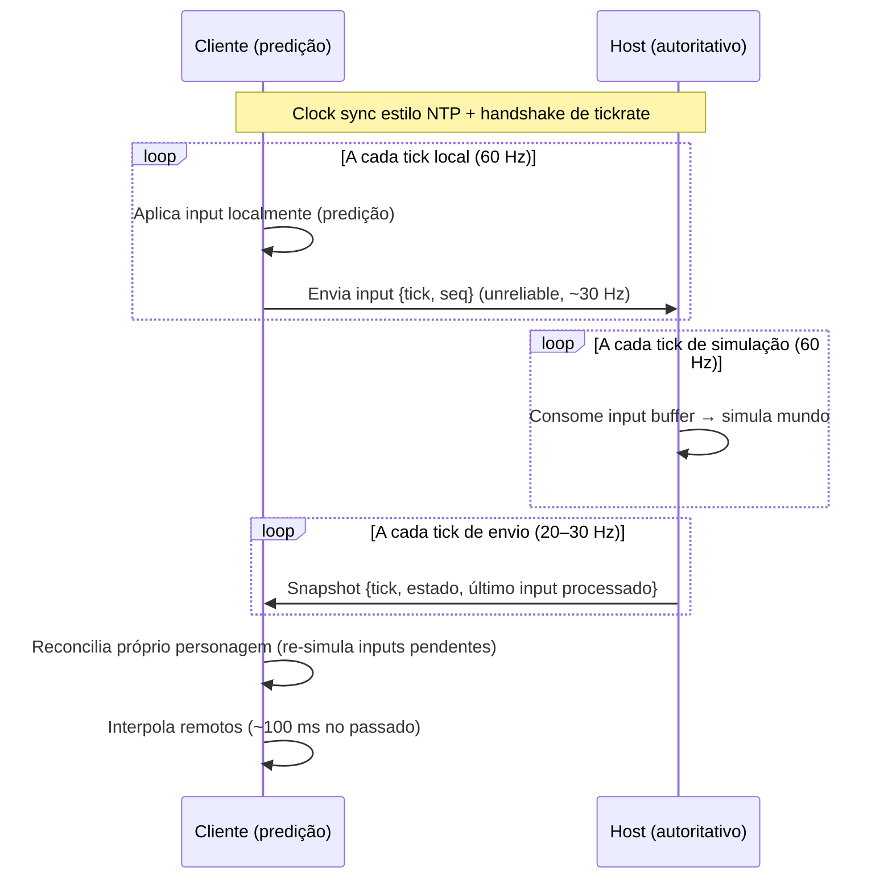

# Plano de Arquitetura — Jogo Multiplayer Online 2D Pixel Art em Godot 4.x

**Versão 1.0 — 18 de agosto de 2026**

## 1. Visão geral, requisitos e metas de latência

### 1.1 Contexto e escopo

Este plano define a arquitetura de referência para um jogo multiplayer online 2D em pixel art desenvolvido em Godot 4.x, com foco central em técnicas de otimização de latência. Como gênero, escala de jogadores e modelo de hospedagem foram deixados em aberto, o documento adota duas estratégias complementares: fixa uma arquitetura de referência padrão — **cliente-servidor autoritativo com o host entre os jogadores (listen server)**, predição no cliente, reconciliação pelo host e interpolação de entidades remotas, com **migração automática do dono da sala** quando o host desconecta — e fornece matrizes de decisão que adaptam essa referência a cada gênero (co-op casual, ação competitivo, fighting/brawler, mundo persistente) e a cada faixa de escala (2–4, 5–16, 17–64, 64+ jogadores).

O ponto de partida factual é o que o Godot 4.6 entrega nativamente em 2026: uma API de alto nível (High-Level Multiplayer API, HLAPI) com três transportes — ENet sobre UDP, WebSocket sobre TCP e WebRTC para P2P — mais os nós de replicação `MultiplayerSpawner` e `MultiplayerSynchronizer` e chamadas remotas via anotação `@rpc`[^3^]. Sobre essa base, quatro lacunas de produção são documentadas de forma consistente pelas fontes: o engine não traz predição no cliente (client-side prediction), não traz rollback netcode, não traz NAT traversal e não traz lobby/matchmaking[^3^]. Essas lacunas não são bloqueadores — são decisões de arquitetura que este plano endereça explicitamente: predição e reconciliação via addon (netfox) ou implementação própria (capítulos 6–7), NAT traversal via noray/Steam/relay (capítulo 10), lobby via Nakama/GD-Sync/Steam (capítulo 10) e **migração de dono da sala** como implementação própria sobre a HLAPI (capítulo 10).

### 1.2 Metas quantitativas de latência e banda

Arquitetura sem orçamento mensurável vira lista de boas intenções. As metas abaixo derivam dos padrões consolidados da literatura técnica (Valve/Source, Gaffer on Games, Gambetta) e da prática da comunidade Godot, e funcionam como SLOs (Service Level Objectives) de engenharia do projeto.

Sem compensação, o atraso entre a tecla pressionada e a resposta na tela é no mínimo um RTT (round-trip time) completo[^7^]. Com predição no cliente, a latência percebida do próprio jogador cai para ~0 ms; o preço é CPU de re-simulação e correções ocasionais (capítulo 6). Para os demais jogadores, a técnica padrão é renderizá-los deliberadamente ~100 ms no passado — o valor `cl_interp 0.1` da Source Engine a 20 atualizações por segundo, que tolera a perda de um snapshot inteiro sem falha visual[^8^]. Em banda, a meta comunitária para jogos Godot é ≤25 kbps por jogador conectado[^26^], com pacotes de sincronização agregados abaixo de ~1350 bytes para respeitar a MTU (~1500 B) e evitar fragmentação IP[^1^].

| Métrica | Meta (SLO) | Base da meta |
|---|---|---|
| Latência percebida (jogador local) | ~0 ms (predição) | Gambetta; webgamedev[^7^][^10^] |
| Atraso deliberado (jogadores remotos) | ~100 ms a 20 Hz de envio | Source Engine, `cl_interp 0.1`[^8^] |
| Banda por jogador | ≤25 kbps | prática comunitária Godot[^26^] |
| Tamanho de pacote de sync | ≤1350–1400 B | MTU ~1500 B, docs Godot[^1^] |
| Tick de simulação (host) | 60 Hz | padrão `Engine.physics_ticks_per_second`[^4^] |
| Send rate (host→cliente) | 20–30 Hz | relação delay ≈ 2×intervalo[^8^] |
| Perda de pacotes tolerada | ≥1 snapshot consecutivo sem artefato | buffer de interpolação[^8^] |

A leitura conjunta da tabela antecipa a tensão central do projeto: send rate é o botão que move simultaneamente latência percebida, banda e **upload do host** — subir de 20 para 60 Hz corta o atraso de interpolação de ~100 ms para ~33 ms, mas triplica a banda, e a banda de saída sai da conexão residencial do host, o gargalo real da sala[^6^]. Os capítulos 7, 8 e 10 quantificam essa relação; o capítulo 13 a transforma em roadmap.

## 2. Topologia de rede e modelo de autoridade

### 2.1 Servidor autoritativo como arquitetura de referência

A decisão estrutural mais importante do projeto precede qualquer linha de código: quem detém a verdade sobre o estado do jogo. A arquitetura de referência deste plano é o **cliente-servidor autoritativo com o host entre os jogadores (listen server)**: os clientes enviam apenas *inputs* (intenções — "andar para a direita", "atacar"), o **host** — um dos jogadores, rodando o mesmo binário do jogo — executa a simulação completa e devolve *estado* (posições, vida, eventos). A documentação oficial do Godot endossa explicitamente o princípio "never trust the client" e recomenda validar argumentos de todo RPC[^1^]; a literatura de referência confirma que esse modelo reduz o upload do cliente a inputs mínimos, previne classes inteiras de cheats e dá resolução única de conflitos[^25^]. Como não há servidor dedicado, o dono da sala é elegível e **migrável**: se ele desconectar, um novo dono é eleito e assume a simulação sem derrubar a partida (seção 10.2).

O benefício de segurança é estrutural, não cosmético: como o cliente nunca envia posição, speed hacks e teleports deixam de existir por construção — não há campo de pacote para adulterar (capítulo 11 detalha). O custo é latência de resposta: sem compensação, o jogador esperaria um RTT inteiro para ver o resultado de cada ação[^7^]. É exatamente para anular esse custo que existem as técnicas dos capítulos 6 e 7 — elas são o núcleo deste plano, não acessórios. No listen server, o host joga com latência zero sobre o próprio personagem; os convidados pagam o RTT até a máquina do host, e o host é confiável por construção (capítulo 11).

### 2.2 Variantes de topologia e seus trade-offs

Três variantes organizam quem é o servidor — e, neste projeto, o servidor **é sempre um dos jogadores**, nunca um processo dedicado. No **listen server**, um dos jogadores hospeda a partida na própria máquina — custo zero de infra, mas o host joga com latência zero enquanto os demais pagam RTT até a casa dele. Sem mitigação, a partida morre se o host sair; a **migração de dono da sala** (seção 10.2) resolve exatamente isso: ao detectar a desconexão do dono, os pares restantes elegem um novo dono e transferem a simulação para ele, sem derrubar a sala. O **servidor dedicado** (processo headless em nuvem[^4^]) fica **descartado por decisão de produto** — o projeto não quer infraestrutura. No **P2P mesh**, cada par conecta-se a todos os demais (o `WebRTCMultiplayerPeer` do Godot segue esse modelo[^3^]): a latência entre dois jogadores pode ser a menor possível (caminho direto), mas o custo de conexões cresce O(n²), NAT atrapalha, e não há autoridade neutra para anti-cheat. A variante **P2P com relay** troca o caminho direto por um servidor intermediário — resolve NAT à custa de adicionar o desvio do relay ao RTT[^19^].

| Topologia | Latência típica | NAT | Custo de infra | Anti-cheat | Indicação |
|---|---|---|---|---|---|
| **Listen server + migração de host** ⭐ | Ótima para o host; RTT até o host para convidados | Host precisa porta aberta ou hole punching/relay | Zero (sem infra) | Fraca para o host (confiável); validação cobre convidados | **Referência deste projeto** |
| Dedicado autoritativo | Consistente; cliente→servidor→cliente | Irrelevante (servidor tem IP público) | Médio (container sob demanda) | Forte (servidor neutro) | Descartado (não queremos infra) |
| P2P mesh (WebRTC) | Menor possível entre pares | Exige hole punching/STUN | Quase zero | Ausente | 1v1 com rollback (fighting) |
| P2P + relay | Maior que P2P direto (desvio do relay) | Sempre funciona | Baixo (relay leve) | Ausente/fraca | Fallback universal de conectividade |

A decisão deste projeto é explícita: **não há servidor dedicado**. A referência passa a ser o listen server com migração de host — custo zero de infra, em troca de dois custos operacionais que os capítulos 10 e 11 tratam de frente: o host precisa ser alcançável (NAT) e, ao sair, precisa ser substituído sem derrubar a partida (migração de dono). O P2P direto só vence em latência quando o hole punching funciona — e ele falha estruturalmente em NAT simétrico, caso em que o relay entra e a vantagem desaparece[^19^]. A matriz final do capítulo 4 combina esta tabela com o modelo de netcode: fighting 1v1 pode preferir P2P+rollback (caminho direto, sem servidor no meio); todo o resto converge para o listen server autoritativo com migração de host.

## 3. Stack multiplayer do Godot 4.x

### 3.1 Transportes: ENet, WebSocket, WebRTC

A camada de transporte do Godot 4.6 oferece três implementações de `MultiplayerPeer`, todas intercambiáveis sob a mesma HLAPI[^3^]. O `ENetMultiplayerPeer` é o padrão: encapsula a biblioteca ENet sobre UDP com canais confiáveis e não-confiáveis, sequenciamento de pacotes e gerenciamento de banda, suportando topologias cliente-servidor e mesh[^34^]. O `WebSocketMultiplayerPeer` usa WebSocket sobre TCP — é a única via simples para exports HTML5, onde UDP não existe, ao preço da latência extra da entrega garantida do TCP (head-of-line blocking de transporte)[^3^]. O `WebRTCMultiplayerPeer` habilita malhas P2P, nativo em builds web e via GDExtension em desktop, exigindo servidor de signaling próprio[^3^].

| Transporte | Protocolo | Confiabilidade | Quando usar |
|---|---|---|---|
| ENet | UDP | Seletiva por canal/pacote (reliable, unreliable, ordered) | Padrão desktop/mobile; host como servidor (listen server) |
| WebSocket | TCP | Sempre confiável e ordenado | Builds HTML5/navegador |
| WebRTC | UDP (DTLS/SCTP) | Configurável por canal de dados | P2P, especialmente web; exige signaling |

A escolha de transporte é menos dramática do que parece: para a arquitetura de referência (listen server autoritativo, clientes desktop/mobile), ENet é a resposta em 2026, e a única decisão real é como usar seus modos de confiabilidade — posição trafega como `unreliable_ordered` (descarta pacotes velhos fora de ordem), eventos discretos como `reliable`, e fluxos distintos em canais distintos para que um volume reliable não atrase o tráfego de estado (head-of-line blocking no nível ENet)[^34^]. O detalhe que cobra pedágio depois: pacotes de sincronização devem respeitar ~1350 bytes úteis para não fragmentar na MTU[^1^].

### 3.2 Replicação de alto nível: Spawner e Synchronizer

Sobre o transporte, o Godot 4.0 introduziu dois nós de configuração que automatizam a replicação de cenas[^2^]. O `MultiplayerSpawner` observa um `spawn_path` e instancia remotamente, em todos os pares, as cenas da sua Auto Spawn List adicionadas pela autoridade (o host, por padrão) — inclusive para quem entra no meio da partida[^28^]. O `MultiplayerSynchronizer` replica propriedades de nós (configuradas no painel Replication) da autoridade para os demais pares, com suporte a visibilidade por par (`set_visibility_for`) — o embrião de interest management nativo[^29^]. O padrão recomendado para jogadores é dar a cada par autoridade sobre um nó filho de *input* (que ele escreve e o host lê), mantendo a autoridade do corpo do personagem no host[^2^].

A limitação documentada é o custo de banda: o Synchronizer não faz delta compression binária entre snapshots — sua "delta" é apenas dirty-flag por propriedade — e sincroniza primitivos serializados como Variant, com overhead de tag e padding[^29^]. É a origem técnica da fama de "pesado" e o motivo pelo qual o capítulo 8 define uma "escotilha de escape": entidades quentes (muitas propriedades × muitos Hz) migram para replicação manual com serialização em `PackedByteArray`, ~2,5× menor e ~10× mais rápida que Variant[^9^].

### 3.3 RPCs e o modelo de autoridade

A anotação `@rpc` configura cada chamada remota em quatro eixos: `mode` (quem pode chamar — `authority` ou `any_peer`), `sync` (`call_remote` ou `call_local`), `transfer_mode` (reliable/unreliable) e `transfer_channel`[^27^]. O padrão seguro consolidado é: inputs e pedidos de ação como `any_peer` + validação no host via `multiplayer.get_remote_sender_id()`; estado e eventos confirmados como `authority` (só o host emite)[^1^]. RPCs falham silenciosamente quando a configuração não casa com o chamador — comportamento mitigado com melhores mensagens de erro no 4.6, mas que ainda justifica disciplina de convenção e testes.

### 3.4 Host como servidor (listen server) e migração de dono da sala

Sem servidor dedicado, o **host** é o jogador que cria a sala: sua instância do jogo roda o `ENetMultiplayerPeer` no papel de servidor e executa a simulação autoritativa, enquanto sua própria câmera/UI o tratam como jogador local — o personagem do host responde localmente, com latência zero. Não há export "Dedicated Server" nem container: o mesmo binário do cliente é o servidor.

A peça central é a **migração de dono da sala** (host migration). Quando o host desconecta — saiu do jogo, caiu a conexão ou fechou o aplicativo — os pares restantes detectam a queda (eventos `peer_disconnected`/`server_disconnected` do `MultiplayerAPI`), elegem deterministicamente o novo dono (ex.: o par de menor `peer_id` entre os sobreviventes) e o promovem a servidor. O protocolo em três passos: (1) **eleição** — todos os pares ordenam os sobreviventes pelo mesmo critério e convergem para o mesmo novo host; (2) **transferência de estado** — o host mantém um snapshot autoritativo do mundo serializado (`PackedByteArray`, via a mesma `NetSync` do capítulo 8) e o replica continuamente para o "host reserva" (o segundo da fila), de modo que a promoção não parta do zero; (3) **re-ligação** — os demais pares reconectam ao novo host (`create_client` para o endereço do eleito, renegociado via signaling), que reassume a simulação com o estado transferido. O jogador que caiu pode reconectar à sala pelo lobby e retomar como convidado.

## 4. Matriz de decisão de netcode por gênero e escala

### 4.1 Os três modelos candidatos

Todo o espaço de design de netcode para este projeto se resume a três modelos, com complexidade crescente. O **modelo A — interpolação simples**: o cliente envia inputs e apenas renderiza o estado que o host devolve, sem prever nada; o próprio jogador sente o RTT, o que é aceitável em co-op casual e ritmo lento. O **modelo B — predição no cliente + reconciliação pelo servidor (CSP)**: o cliente simula o próprio personagem imediatamente e corrige divergências quando o servidor responde; é o padrão da indústria para ação e shooters[^7^][^10^]. O **modelo C — rollback estilo GGPO**: todos os jogadores preveem os inputs uns dos outros; ao errar, o jogo volta N frames e re-simula com os inputs corretos — invisível quando a previsão acerta, o que acontece na grande maioria dos frames (repetir o último input conhecido já acerta ~90%+ em fighting games)[^32^].

### 4.2 Matriz de decisão

| Gênero / ritmo | Jogadores | Modelo recomendado | Stack de física | Addon/stack Godot |
|---|---|---|---|---|
| Co-op casual, ritmo lento | 2–8 | A (interpolação) | Godot Physics livre | HLAPI pura (Spawner/Synchronizer) |
| Ação/shooter competitivo | 2–16 | B (CSP + reconciliação) | Qualquer (host corrige) | netfox (RollbackSynchronizer)[^12^] |
| Fighting/brawler 1v1 frame-perfect | 2 | C (rollback P2P) | Determinística: SGPhysics2D (fixed-point) | godot-rollback-netcode / Delta Rollback[^15^][^16^] |
| Party/brawler 4+ jogadores | 4–16 | B (CSP server-authoritative) | Qualquer; Rapier se física+rollback[^13^] | netfox |
| Mundo persistente / RPG | 17–64+ | A/B híbrido + AOI agressivo | Qualquer | Replicação manual + interest management |
| Estratégia/simulação determinística | 2–8 | Lockstep determinístico | Fixed-point obrigatório | Input-only networking |

Duas linhas da tabela carregam decisões irreversíveis e merecem leitura lenta. A primeira é o rollback: retrofitá-lo é ordens de magnitude mais caro do que nascê-lo — o caso clássico documentado é o da NetherRealm (~8 man-years para retrofitar em Mortal Kombat X) contra ~2 semanas em Skullgirls, projetado desde o início[^32^]. Se houver qualquer chance de o jogo ser um fighting/brawler frame-perfect, a decisão do modelo C é de dia zero. A segunda é a física: o modelo C exige determinismo bit a bit — mesma entrada, mesma saída, em qualquer máquina — e a Godot Physics padrão, baseada em floats, não é determinística entre plataformas (a proposta de determinismo do engine, #7128, segue aberta)[^30^]. A saída documentada é a SGPhysics2D, física 2D em ponto fixo (64.16) desenhada para rollback[^15^]. Invertendo a intuição comum: **a escolha do netcode determina a stack de física, não o contrário** — no modelo B, o servidor autoritativo corrige divergências e qualquer física serve; no modelo C, a física padrão está vetada antes do primeiro protótipo.

O fechamento da matriz com a topologia do capítulo 2 é direto: modelo C roda melhor em P2P direto (1v1, caminho mais curto, sem servidor no meio); modelos A e B convergem para o **listen server autoritativo com migração de host**. Os casos reais de 2026 confirmam a divisão: Brawlhalla, brawler de plataforma 2D, roda rollback com cross-play em consoles, PC e mobile[^24^]; Dome Keeper (co-op/versus até 8 jogadores em Godot) segue o caminho servidor-autoritativo sobre a HLAPI[^21^].

## 5. Pipeline de tick e sincronização de estado

### 5.1 Tick de simulação vs. send rate

O coração temporal da arquitetura são dois relógios desacoplados. O **tick de simulação** é a taxa em que o host resolve o estado do jogo — 60 Hz por padrão no Godot (`Engine.physics_ticks_per_second`), valor sensato para a maioria dos jogos de ação, podendo subir em competitivo rápido e descer em jogos lentos para economizar CPU por sessão[^4^]. O **send rate** é a taxa em que o host transmite snapshots aos clientes — e não há obrigação de igualá-lo ao tick: enviar a 20–30 Hz enquanto se simula a 60 Hz é o ponto ótimo consolidado desde a Source Engine[^8^]. A relação que governa a decisão é rígida: o atraso de interpolação necessário no cliente é aproximadamente duas vezes o intervalo de envio — 20 Hz ⇒ ~100 ms, 30 Hz ⇒ ~66 ms, 60 Hz ⇒ ~33 ms[^8^]. Send rate é, portanto, uma decisão simultânea de UX (suavidade dos remotos), de banda (linear no rate) e de viabilidade (egress do host), como quantifica o capítulo 8.

### 5.2 Sincronização de relógio e buffers

Para que cliente e host falem a mesma língua temporal, três mecanismos trabalham juntos. Primeiro, **sincronização de relógio**: estima-se o offset entre os relógios das duas pontas com trocas periódicas estilo NTP, de modo que um "tick 1234" signifique o mesmo instante nos dois lados; o netfox implementa exatamente isso (três relógios: local, remoto e de tick) com handshake de tickrate[^12^]. Segundo, **adiantamento do cliente**: para que o input chegue ao host no tick em que deve ser aplicado, o cliente roda sua simulação ~RTT/2 ticks à frente do host[^12^]. Terceiro, **input buffer no host**: os inputs recebidos entram numa fila indexada por tick, com profundidade dimensionada para o RTT — o host aplica o input do tick T quando sua simulação chega a T, tolerando jitter de chegada; buffers práticos ficam entre 20 e 100 ms conforme o jitter medido (capítulo 12)[^8^].

### 5.3 Diagrama do pipeline



O diagrama expõe a propriedade que torna o pipeline robusto: cada fluxo tem confiabilidade e frequência próprias. Inputs sobem em `unreliable` (perder um é irrelevante — o próximo já carrega o estado mais novo, e envia-se redundância do input anterior[^9^]); snapshots descem em `unreliable_ordered` (o ENet descarta automaticamente snapshots velhos que chegarem fora de ordem); apenas eventos discretos — morte, fim de partida, chat — sobem a `reliable`[^34^]. Nada nesse pipeline bloqueia nada: não há reliable no caminho quente, logo não há head-of-line blocking entre o estado do jogo e o resto do tráfego. Os capítulos 6 e 7 detalham, respectivamente, o que acontece dentro das caixas "reconcilia" e "interpola" — os dois pontos onde a latência é efetivamente escondida do jogador.

## 6. Otimização de latência I — predição e reconciliação

### 6.1 Client-side prediction: anular o RTT do próprio jogador

Sem predição, o caminho de uma ação é: tecla → pacote ao host → simulação → snapshot de volta → renderização. O jogador sente no mínimo um RTT completo entre a intenção e o feedback — 150 ms de ping significam 150 ms de "peso" em cada movimento, o que inviabiliza qualquer jogo de ação[^7^]. A predição no cliente (client-side prediction, CSP) elimina esse atraso com uma ideia simples: o cliente roda **a mesma simulação do host** localmente e aplica o próprio input no instante em que ele ocorre, sem esperar a rede[^10^]. O personagem responde em 0 ms; a rede deixa de estar no caminho crítico da experiência do jogador local.

O pré-requisito arquitetural é consequência direta: a lógica de movimento/simulação do personagem deve ser compartilhada byte a byte entre cliente e host — no Godot, o mesmo script GDScript roda nos dois lados (host e convidado executam o mesmo binário do jogo), o que elimina a classe de bugs "cliente e host calculam diferente por implementações distintas".

### 6.2 Server reconciliation: convergir sem mentir

Predição sem correção diverge: pacotes se perdem, outros jogadores colidem com você, o host nega uma ação inválida. A reconciliação fecha o ciclo em quatro passos documentados pela literatura clássica (Gambetta; Valve/Bernier)[^7^][^8^]: (1) cada input sai do cliente com número de sequência/tick; (2) o cliente guarda os inputs ainda não confirmados num buffer circular; (3) o host responde, em cada snapshot, o estado autoritativo do personagem **mais o último input processado** daquele jogador; (4) o cliente descarta do buffer os inputs já confirmados, compara seu estado previsto no tick confirmado com o estado do host e, se divergirem, **rebobina ao estado do host e re-simula os inputs pendentes** — tudo antes do próximo frame renderizado.

O custo é quantificável: a re-simulação cobre ~RTT ticks; com RTT de 300 ms a 60 Hz, são ~18 ticks re-simulados num único frame (18–22 com jitter) — a documentação do Unity Netcode registra o mesmo número (~22 frames a 300 ms) e o classifica como overhead substancial[^11^]. As mitigações padrão: re-simular apenas a entidade do jogador local (não o mundo), executar a re-simulação sem efeitos visuais/sonoros, e manter a função de simulação barata (em 2D pixel art, movimento por `CharacterBody2D` é ordens de magnitude mais leve que física de corpos rígidos). O netfox expõe monitores dedicados justamente para esse custo de rollback/re-simulação[^12^].

### 6.3 Implementação em Godot

O caminho de menor risco em 2026 é o addon **netfox** (foxssake), que implementa exatamente este modelo — server-authoritative com CSP e reconciliação via `RollbackSynchronizer`, sincronização de tempo (`NetworkTime`), interpolação de ticks (`TickInterpolator`) e integração noray para conectividade[^12^]. É código de produção: há jogos na Steam construídos sobre ele (Bubble Battle, Chrome Carnage, Plan B4), e releases recentes adicionaram física com rollback (via addon Rapier ou build custom do engine), sincronizadores sem input para NPCs/bots e filtro de visibilidade por par[^13^][^14^]. O esqueleto conceitual do fluxo de input, para implementação própria ou para entender o que o netfox automatiza:

```gdscript
# CLIENTE — a cada tick de simulação
func _tick(delta):
    var input := InputState.gather()              # direção, botões
    input_buffer.store(current_tick, input)       # guarda p/ reconciliação
    apply_input(input, delta)                     # predição: aplica já
    send_input.rpc_id(1, current_tick, input)     # sobe p/ host
    current_tick += 1

# HOST — valida e confirma
@rpc("any_peer", "unreliable")
func send_input(tick: int, input: Dictionary) -> void:
    var peer := multiplayer.get_remote_sender_id()
    input_queue[peer].store(tick, input)          # input buffer (≥ RTT)

# CLIENTE — ao receber snapshot do host
func _on_server_state(tick: int, state: Dictionary, last_input: int) -> void:
    input_buffer.discard_up_to(last_input)        # confirma inputs
    if predicted_state_at(tick) != state:         # divergiu?
        rewind_to(state)                          # volta ao estado oficial
        for pending in input_buffer.pending():    # re-simula o restante
            apply_input(pending, tick_delta)
```

### 6.4 Suavização de correções

A reconciliação corrige o **estado simulado**; se essa correção for aplicada direto à posição renderizada, o jogador vê "snaps" (teleportes de alguns pixels) a cada divergência. A solução consolidada é separar as duas posições: o estado simulado corrige instantaneamente (integridade), e a posição renderizada converge por interpolação linear ao longo de alguns frames (estética)[^9^]. Em pixel art, essa suavização opera sobre a posição lógica em subpixel — a quantização para a grade de pixels acontece só na renderização (capítulo 9), evitando que o snap de pixel torne correções de 1–2 px visíveis como jitter.

## 7. Otimização de latência II — interpolação, lag compensation e rollback

### 7.1 Entity interpolation: esconder a latência dos outros

Para entidades que o jogador não controla, não existem inputs futuros para prever — a saída é o caminho oposto: em vez de extrapolar o futuro, renderiza-se o passado. A técnica consolidada pela Source Engine é manter um buffer de snapshots recebidos, indexado pelo **timestamp do host** (não pelo tempo de chegada, que introduziria "wobble" com o jitter), e renderizar as entidades remotas ~100 ms atrás do presente — o valor `cl_interp 0.1` a 20 Hz, exatamente duas vezes o intervalo de envio, o que tolera a perda de um snapshot inteiro sem falha visual[^8^]. Entre dois snapshots consecutivos, posição e animação interpolam linearmente; o resultado é movimento perfeitamente suave a custa de um atraso deliberado e constante.

O buffer de interpolação é, ao mesmo tempo, o **jitter buffer**: sua profundidade deve cobrir intervalo de envio + jitter medido + um pacote de margem. Implementações modernas o tornam adaptativo (30–150 ms), apertando quando a rede está limpa e abrindo sob jitter — upgrade natural sobre o default fixo[^9^]. A alternativa, dead reckoning (extrapolar pela última velocidade conhecida), deve ficar restrita a fallback de 100–250 ms: extrapolação erra exatamente nas mudanças bruscas de direção, e jogos 2D com dash e teleporte as têm como mecânica central[^9^].

### 7.2 Lag compensation: justiça no host

A interpolação cria um problema de justiça: o jogador atira onde *vê* o alvo — 100 ms no passado. Se o host validar o tiro contra o estado presente, tiros certos erram. A lag compensation resolve rebobinando o estado das demais entidades no host para o instante em que o cliente as viu (função do RTT + interp delay daquele cliente) e validando a ação contra esse estado histórico[^8^]. Em 2D com hitboxes simples, o rewind é barato: guardar as últimas ~32 posições (≈0,5 s a 60 Hz) por entidade. O parâmetro de tolerância importa: validações rígidas demais punem jogadores legítimos com jitter; a faixa prática documentada é 1,1–1,2× sobre os limites teóricos (velocidade, cooldown), com whitelist explícita para mecânicas rápidas como dash[^8^].

### 7.3 Rollback netcode: prever os outros, não só a si mesmo

O rollback generaliza a predição para todos os jogadores: prevê-se o input remoto (repetir o último conhecido acerta ~90%+ dos frames em fighting games), salva-se o estado completo a cada frame e, quando o input real chega diferente do previsto, volta-se ao frame do erro e re-simula-se até o presente — idealmente dentro do mesmo frame renderizado, invisível ao jogador[^32^]. É o padrão ouro dos fighting games modernos (Guilty Gear Strive consolidou; Brawlhalla roda com cross-play total[^24^]) porque esconde a latência dentro do startup das animações.

Em Godot, a implementação de referência é o **godot-rollback-netcode** (David Snopek), com a **SGPhysics2D** resolvendo o determinismo (ponto fixo 64.16; a Godot Physics em floats não é determinística cross-platform[^30^]) e o fork **Delta Rollback** (BimDav) portando o núcleo para C++/GDExtension com ganho expressivo de performance; há demo completa de fighting game (hitbox/hurtbox, state machine, command buffer) em Godot 4.2.2[^15^][^16^]. O custo a orçar: save/restore de estado por frame e re-simulação de N frames — em 2D com mundo pequeno, ambos são baratos, o que torna o 2D o cenário ideal para rollback; o caso contrário documentado é o MKX, cujo frame foi de 10 para 32 ms com rollback ingênuo em 3D[^32^].

| Técnica | O que esconde | Custo principal | Quando usar |
|---|---|---|---|
| Predição (CSP) | Latência do próprio jogador | CPU de re-simulação no cliente | Sempre que houver servidor autoritativo |
| Interpolação | Latência/jitter dos remotos | ~100 ms de atraso deliberado | Default para todas as entidades remotas |
| Lag compensation | Desalinhamento temporal da validação | Rewind de estado no host | Ações com alvo (tiros, golpes) |
| Rollback | Latência dos inputs remotos | Save/restore + re-simulação global | Fighting/brawler 1v1, frame-perfect |

Lidas em conjunto, as quatro linhas da tabela formam a tese central deste plano: **latência percebida se resolve em camadas independentes** — uma para o próprio jogador (predição), uma para os outros (interpolação), uma para a justiça (lag compensation) e, opcionalmente, uma global (rollback). Cada camada tem dono, orçamento e métrica próprios (capítulo 12), e pode ser introduzida, medida e otimizada sem perturbar as demais.

## 8. Otimização de banda e interest management

### 8.1 Orçamento e serialização

Banda é o recurso que conecta engenharia a viabilidade: sem servidor dedicado, o egress (banda de saída) sai da **conexão doméstica do host** — normalmente assimétrica, com upload muito menor que o download — e vira o gargalo real da sala. Uma partida de 10 jogadores a 60 Hz gera ~2–5 GB de tráfego de saída por hora na máquina do host[^6^]; o orçamento de ≤25 kbps por jogador[^26^] deixa de ser meta de custo e passa a ser o limite de quantos convidados cabem no upload do host (capítulo 10.4). Dois fatos estruturam a estratégia. Primeiro, o overhead por pacote no fio é de ~40–75 bytes (cabeçalhos IP/UDP/ENet), portanto muitos pacotes pequenos são desperdício puro: agrega-se **um pacote por tick de envio por cliente**, com teto de ~1400 bytes (MTU)[^5^][^1^]. Segundo, a serialização padrão do Godot (Variant) cobra ≥4 bytes de tag por valor mais padding; a serialização manual em `PackedByteArray` é ~2,5× menor e ~10× mais rápida[^9^].

A quantização é a maior alavanca: floats de 32 bits raramente carregam informação proporcional ao seu tamanho. A técnica bound+quantize de Glenn Fiedler reduz uma posição 3D de 96 para ~50 bits com precisão controlada[^9^]; em 2D pixel art é ainda mais agressiva — com mundo delimitado (ex.: 4096×4096 px) e resolução de 1/16 de pixel, cada eixo cabe em 16 bits (12–16 bits/eixo é a faixa documentada), e ângulos comprimem para 8–16 bits. Uma posição 2D completa custa 4 bytes em vez dos 16+ de dois floats Variant.

### 8.2 Confiabilidade seletiva e canais

A regra de confiabilidade já apareceu no pipeline (capítulo 5) e aqui ganha sua justificativa de banda: estado contínuo (posição, vida em regeneração) trafega `unreliable_ordered` — perder um snapshot é irrelevante porque o próximo o substitui, e o ordered descarta automaticamente os que chegarem atrasados; eventos discretos (dano, morte, pickup) sobem a `reliable`, com parcimônia, porque grandes volumes reliable criam filas de retransmissão que estrangulam a conexão — advertência do próprio autor do ENet[^34^]. Canais ENet separam os fluxos: estado quente no canal 1, eventos no canal 2, chat no canal 3 — nenhum volume de um atrasa o outro[^34^].

### 8.3 Delta compression e acks

O passo seguinte é enviar, a cada snapshot, apenas o que mudou em relação ao último snapshot que o cliente **confirmou** ter recebido. O mecanismo clássico (Fiedler; modelo Valve) adiciona 6 bytes de cabeçalho por pacote — `sequence` (2 B), `ack` (2 B) e `ack_bits` (4 B, bitfield dos 32 pacotes anteriores) — para que o host saiba exatamente qual snapshot cada cliente tem como baseline; contra essa baseline, campos inalterados custam 1 bit mais offset[^9^]. O ganho reportado é de "ordem de magnitude" sobre tráfego de estado, ao preço de implementar acks custom sobre UDP — fora do que o `MultiplayerSynchronizer` oferece nativamente (sua "delta" é só dirty-flag por propriedade[^29^]), o que ancora a escotilha de escape descrita em 8.5.

### 8.4 Interest management

Sem noção de relevância, o host transmite o estado de todas as entidades para todos os clientes: custo O(n²) — 64 jogadores se atualizando mutuamente a 20 Hz já somam ~8 MB/s agregados[^29^]. Interest management (área de interesse, AOI) envia a cada cliente apenas as entidades próximas/relevantes, com redução típica de ~8× no tráfego. Em Godot há três níveis: o nativo `set_visibility_for`/`public_visibility` do Synchronizer[^29^]; o filtro de visibilidade por par do `RollbackSynchronizer` do netfox[^14^]; e, para mundos grandes, spatial hashing próprio no host (busca por vizinhos ~30× mais rápida que varredura linear) alimentando listas de relevância por cliente[^9^].

### 8.5 A escotilha de escape

A decisão arquitetural crítica do Godot não é "qual netcode", mas **onde termina a HLAPI e começa a replicação manual** — e o ponto de corte é função do número de propriedades sincronizadas por tick, não do número de jogadores. A recomendação: começar 100% HLAPI (Spawner/Synchronizer) no protótipo; isolar toda a replicação atrás de uma interface própria (`NetSync`); e migrar entidades quentes para serialização manual quantizada + delta compression conforme o profiler (Wireshark, não o Network Profiler do editor, que subestima a banda em ~10–25×[^35^]) apontar. A tabela final consolida a decisão de send rate:

| Send rate | Interp delay (≈2×intervalo) | Banda relativa | Uso recomendado |
|---|---|---|---|
| 20 Hz | ~100 ms | 1× | Default 2D indie; co-op e ação |
| 30 Hz | ~66 ms | 1,5× | Ação competitiva com orçamento |
| 60 Hz | ~33 ms | 3× | Competitivo sério; pesa no upload do host[^6^] |

## 9. Considerações específicas de pixel art 2D

### 9.1 Determinismo e física

A escolha de pixel art 2D simplifica radicalmente dois dos problemas mais caros do netcode. O primeiro é o determinismo: se a matriz do capítulo 4 apontar rollback (modelo C), a física padrão do Godot está vetada — floats não são determinísticos entre plataformas e a proposta de determinismo do engine segue aberta (#7128)[^30^]. Em 2D, a saída é madura e barata: a SGPhysics2D implementa física em ponto fixo (64.16) desenhada para rollback[^15^], e muitos jogos 2D vão além — implementam movimento e colisão custom em inteiros (a lógica de um platformer cabe em poucas centenas de linhas), obtendo determinismo total sem engine de física alguma. Se a matriz apontar CSP (modelo B), o problema some: o servidor autoritativo corrige divergências e a Godot Physics padrão pode ficar.

### 9.2 Renderização, pixel snap e movimento

Pixel art impõe uma disciplina de renderização que interage diretamente com o netcode. Posições lógicas devem viver em subpixel (float ou fixed-point) para que predição, reconciliação e interpolação operem com precisão contínua; a quantização para a grade de pixels (pixel snap) acontece **somente na renderização**, como último passo. Aplicar snap à posição lógica destruiria a reconciliação (erros de arredondamento acumulam como divergência) e tornaria correções de 1–2 px visíveis como jitter. Duas configurações de engine merecem atenção: a physics interpolation nativa do Godot (disponível para 2D desde o 4.3) deve ser **desligada** em nós dirigidos pela rede — ela interpola entre ticks de física locais, conceito diferente da interpolação de rede, e as duas brigam entre si[^1^]; e o `TickInterpolator` do netfox (ou buffer próprio) assume a suavização visual das entidades remotas[^12^].

### 9.3 Por que 2D é o cenário ideal para netcode agressivo

Três propriedades do 2D pixel art jogam a favor do projeto. Mundo pequeno e estado compacto: o save/restore de estado exigido pelo rollback e pela reconciliação é barato quando o mundo inteiro cabe em kilobytes — contraste com o caso MKX (10→32 ms/frame em 3D)[^32^]. Hitboxes simples: retângulos e círculos tornam o rewind da lag compensation trivial (capítulo 7). E banda naturalmente baixa: com posições quantizadas a 4 bytes e dezenas de entidades relevantes por cliente (AOI, capítulo 8), o orçamento de 25 kbps/jogador deixa folga para send rates maiores quando o jogo pedir[^26^]. A contrapartida: mecânicas 2D rápidas (dash, teleporte, knockback) quebram extrapolação — dead reckoning deve ficar confinado ao fallback curto, e a suavidade vem da interpolação curta com send rate adequado, não de adivinhar o futuro[^9^].

## 10. Infraestrutura: NAT, hospedagem, matchmaking e escalabilidade

### 10.1 NAT traversal

A arquitetura de referência (listen server) coloca o problema de NAT **dentro da sala**: o host é quem precisa estar alcançável, e a maioria dos roteadores domésticos bloqueia conexões UDP de entrada[^3^]. O Godot não traz NAT traversal nativo — a saída é a mesma do P2P: hole punching quando o NAT permite, relay quando não. A técnica padrão é UDP hole punching: ambos os pares consultam um servidor STUN para descobrir seu IP:porta públicos, trocam esses endereços por um canal externo e disparam pacotes simultâneos que "furam" o NAT; funciona para NATs de cone (full/restricted/port-restricted) e falha estruturalmente em NAT simétrico, caso em que a única saída é relay[^19^]. Em Godot, três rotas empacotadas: o addon **noray** (com integração pronta no netfox.noray e instância pública de testes), o **GodotSteam** — Steam Networking Sockets com relay e NAT traversal da Valve, integrando-se como `MultiplayerPeer` sem mudar o código de RPC/replicação — e relay próprio[^12^][^3^]. Detalhe de implementação que importa: o hole punching exige controlar a porta local de envio, disponível via `PacketPeerUDP.bind()`[^20^].

### 10.2 Sala hospedada pelo jogador e migração de dono

Sem infraestrutura, cada sala é criada e hospedada por um jogador. O ciclo de vida de uma sala tem quatro estados: (1) **criação** — o primeiro jogador abre a sala, vira host e publica o convite no lobby (código da sala ou listagem); (2) **sessão** — o host roda a simulação autoritativa e replica para os convidados (capítulos 5–8); (3) **migração** — se o host cai, os sobreviventes elegem o novo dono e a partida continua; (4) **encerramento** — quando a sala esvazia ou resta um único jogador, a sessão termina no próprio cliente, sem processo para "self-terminate".

A migração de dono é o ponto que mais exige engenharia. O protocolo recomendado:

```gdscript
# HOST — mantém um "host reserva" sempre aquecido
func _on_peer_connected(id: int) -> void:
    if peers.is_empty():
        backup_host_id = id             # primeiro convidado vira reserva

func _process(_delta: float) -> void:
    if multiplayer.is_server() and backup_host_id != 0:
        # replica o snapshot autoritativo continuamente para o reserva
        send_world_snapshot.rpc_id(backup_host_id, serialize_world())

# TODOS — ao detectar a queda do host
func _on_server_disconnected() -> void:
    var survivors := get_surviving_peers()      # ordenados por peer_id (determinístico)
    if survivors.is_empty():
        end_room()                              # sala morre; todos voltam ao lobby
    elif survivors[0] == multiplayer.get_unique_id():
        promote_to_host(load_backup_snapshot()) # reserva assume a simulação
    else:
        reconnect_to(survivors[0])              # conecta ao novo dono
```

Os requisitos de correção são três: a **eleição precisa ser determinística** (mesmo critério em todos os pares — ex.: menor `peer_id` sobrevivente — para ninguém divergir sobre quem é o novo dono); o **estado precisa ser transferível** (o snapshot autoritativo serializado, no mesmo formato do capítulo 8, replicado continuamente para o reserva, de modo que a promoção custe O(1) e não uma re-simulação desde o tick zero); e a **sala precisa sobreviver à reconexão** (o jogador que caiu reentra pela listagem do lobby como convidado do novo host). Como o novo host era um convidado até instantes antes, a promoção é a transição mais delicada do ciclo de vida da sala e merece teste dedicado no capítulo 12.

### 10.3 Lobby e matchmaking

A camada acima do transporte — autenticação, salas, matchmaking — também não é nativa[^3^]. Duas soluções gerenciadas cobrem-na sem backend próprio: **Nakama**, servidor open-source com autenticação, matchmaking, leaderboards e realtime, com client oficial Godot em GDScript e suporte a partidas server-authoritative ou relayed[^18^]; e **GD-Sync**, plugin Godot com lobbies e matchmaking[^3^]. Quem publica na Steam obtém lobbies e matchmaking "de graça" via GodotSteam[^3^]. O padrão arquitetural é lobby → sessão: o serviço de matchmaking forma o grupo, **elege o host** (em geral, o criador da sala), entrega o endereço aos clientes e passa a tratar a sala como responsabilidade do host — se o host cair, a eleição da seção 10.2 assume, e o lobby só precisa refletir a nova listagem para permitir reconexões.

### 10.4 Escalabilidade honesta

O teto do transporte é alto (ENet suporta até 4095 peers), mas o teto prático de uma sala hospedada por um jogador é definido pelo **upload residencial do host** antes de qualquer limite de protocolo: com ~25 kbps por convidado[^26^], um host com upload de 1 Mbps já fica no limite com ~40 convidados, e uploads domésticos típicos (2–10 Mbps) na prática seguram salas confortáveis na casa das dezenas. Some-se o limite da replicação de alto nível: testes citados pela Rivet apontam instabilidade acima de ~40 CCU, um relato da CipSoft descreve degradação em ~80–100 clientes, e a regra prática da comunidade coloca o Synchronizer confortável até ~16 jogadores, exigindo replicação manual a partir de ~32[^3^]. A postura arquitetural correta é a do capítulo 8: projetar a escotilha de escape, tratar "dezenas de jogadores por sessão" como o envelope seguro do Godot em 2026 — os cases reais vão até 8 jogadores online (Dome Keeper)[^21^] — e substituir qualquer número de tabela por **teste de carga próprio com bots headless** contra um host real (capítulo 12). MMO (64+) fica fora do envelope da HLAPI e, sem servidor dedicado, está descartado por decisão de produto.

## 11. Segurança e anti-cheat

### 11.1 Autoridade como fundação

A decisão tomada no capítulo 2 paga aqui seu maior dividendo: com o host simulando a partir de inputs, classes inteiras de cheats deixam de existir estruturalmente **para os convidados**. Speed hack e teleport pressupõem que o cliente envia posição — neste modelo, não há campo de pacote para adulterar; o máximo que um cliente modificado pode fazer é enviar inputs, e inputs impossíveis (velocidade acima do permitido, ações em cooldown, disparo sem munição) são rejeitados pela mesma simulação que governa os jogadores honestos[^1^][^25^]. A ressalva do listen server é o próprio host: ele roda a simulação e é **confiável por construção** — pode ler todo o estado e forçar qualquer resultado. A validação no host, portanto, protege a sala contra convidados trapaceiros, mas não contra um host mal-intencionado; para isso, a única saída real seria o dedicado, descartado por decisão de produto (capítulo 2.2). A disciplina de implementação é conhecida: todo RPC `any_peer` é um ponto de entrada e deve validar remetente (`get_remote_sender_id()`), tipos e faixas de argumentos — a documentação oficial dedica seção a esse "secure multiplayer design"[^1^].

### 11.2 Camadas de defesa

Sobre a fundação, quatro camadas, em ordem de custo-benefício. **Validação contínua no host**: sanity checks de movimento com tolerância 1,1–1,2× (abaixo disso, jitter vira falso positivo) e whitelist explícita para mecânicas rápidas (dash, teleporte)[^8^]. **Rate limiting por ação**: o padrão gatekeeper documentado em produção indie após o caso WEBFISHING — um `MessageValidator` com limite de taxa por tipo de ação, bloqueando floods de RPC[^1^]. **Autenticação e criptografia de transporte**: o SceneMultiplayer traz handshake de autenticação de sessão; ENet suporta DTLS e WebSocket suporta WSS/TLS (certificado autoassinado é inviável no navegador)[^1^]. **Mínimo de conhecimento**: o host só envia ao cliente o que ele precisa saber (o AOI do capítulo 8 é também uma defesa contra wall hacks por construção)[^25^].

A pergunta "preciso de anti-cheat de kernel (EAC e similares)?" tem resposta quantificada para o escopo deste plano: a validação no host entrega ~90% do valor contra convidados trapaceiros em um 2D indie, e o Easy Anti-Cheat — gratuito e engine-agnostic, com plugin de terceiros para Godot — só se justifica quando há incentivo econômico real a trapacear (competitivo sério com ranking/premiação)[^36^]. O que fica fora do alcance de qualquer validação no host é automação de input (bots/aim): aí o anti-cheat de cliente tem seu lugar — como segunda fase, não como fundação. A recomendação final é arquitetural, não de produto: invista na autoridade e na validação (baratas, sempre ligadas, sem falsos positivos de kernel) e trate o EAC como decisão adiável ao lançamento competitivo.

## 12. Medição, telemetria e QA de rede

### 12.1 Medição em runtime

Netcode sem medição é netcode quebrado que ainda não foi descoberto. Em runtime, o ENet expõe por conexão, via `ENetPacketPeer.get_statistic()`, o RTT estimado, sua variância (que é o jitter operacional) e a taxa de perda na janela recente (~10 s)[^35^] — os três números que alimentam as decisões adaptativas dos capítulos 5 e 7 (profundidade do input buffer, tamanho do jitter buffer). Um aviso de instrumentação com consequência prática: o Network Profiler do editor Godot subestima a banda real em ~10–25× e ignora compressão — a fonte de verdade para banda é captura no fio (Wireshark) ou contadores do sistema[^35^].

### 12.2 Simulação de condições ruins

Todo o pipeline de compensação de latência só é exercido de verdade sob rede ruim; testar em localhost (RTT ~0) certifica o caminho feliz e esconde os bugs. O kit padrão por plataforma: **clumsy** no Windows (latência, jitter, perda, duplicação, reordenação por filtro)[^33^]; **Network Link Conditioner** no macOS/iOS (perfis prontos como "3G", "Edge", perda custom)[^37^]; **tc/netem** no Linux — ex.: `tc qdisc add dev eth0 root netem delay 100ms 20ms loss 2%` injeta 100±20 ms com 2% de perda[^33^]. O netfox traz uma quarta opção embutida: simulação de latência e perda por configuração de projeto, dispensando ferramentas externas no loop de desenvolvimento[^14^]. O protocolo mínimo de QA de rede deve varrer a matriz {50, 100, 200, 300 ms} × {0, 1, 5% de perda} × {0, 25 ms de jitter} — os pontos onde reconciliação, interpolação e validação mostram seus limites.

### 12.3 Telemetria e teste de carga

Em produção, a telemetria por sessão registra: ping médio e p99 por cliente, perda, taxa de reconciliações com divergência (sinal de bug de simulação compartilhada), tempo de tick do host (p99) e banda por jogador contra o orçamento de 25 kbps[^26^]. O teste de carga usa bots headless — instâncias do próprio cliente em modo headless conectando a um host e gerando inputs sintéticos — para medir o envelope real de convidados por sala na *sua* cena de jogo, substituindo os números conflitantes da literatura (40 vs. 80–100, capítulo 10) por um número seu[^3^]. Um caso de teste obrigatório e específico do listen server é a **migração de host**: desconectar o dono em cada ponto da partida (durante o spawn, em meio a eventos de arena, com todos os convidados ativos) e medir o tempo de promoção e a perda de estado. A métrica que governa a viabilidade da sala é o tempo de tick no host — `physics_ticks_per_second` × custo por tick × convidados define o footprint de CPU na máquina do host — e o upload do host define quantos convidados cabem (capítulo 10.4).

| Ferramenta | Plataforma | Função | Quando usar |
|---|---|---|---|
| `ENetPacketPeer.get_statistic` | Todas | RTT, jitter, perda em runtime | HUD de debug, telemetria[^35^] |
| Wireshark | Todas | Banda real no fio | Validar orçamento de banda[^35^] |
| clumsy | Windows | Injetar latência/perda/jitter | QA de netcode[^33^] |
| Network Link Conditioner | macOS/iOS | Perfis de rede ruins | QA de netcode[^37^] |
| tc/netem | Linux | Injeção precisa de condições | CI e testes no host[^33^] |
| netfox network simulation | In-engine | Latência/perda por config | Loop diário de dev[^14^] |
| Bots headless | Host | Teste de carga CCU | Antes de comprometer escala[^3^] |

## 13. Roadmap de implementação e riscos

### 13.1 Fases de implementação

O roadmap consolida os capítulos anteriores em cinco fases sequenciais, cada uma com critério de saída verificável. A ordenação reflete a lição dominante dos casos reais: netcode é decisão de dia zero — Dome Keeper e Pratfall adicionaram multiplayer a codebases existentes e pagaram o custo de retrofit; o caso NRS (8 man-years) contra Skullgirls (2 semanas) quantifica o preço de adiar[^21^][^23^][^32^].

**Fase 0 — Decisões irreversíveis (1–2 semanas).** Escolher pela matriz do capítulo 4: modelo de netcode (A/B/C), stack de física (Godot Physics vs. SGPhysics2D/inteiros) e topologia — com a restrição já decidida de **listen server com migração de host** (sem servidor dedicado). Critério de saída: ADR (Architecture Decision Record) de uma página por decisão, incluindo o protocolo de eleição/transferência de dono da seção 10.2. **Fase 1 — Vertical slice HLAPI (2–4 semanas).** Dois clientes, um deles como host (listen server, sem Docker), spawn via `MultiplayerSpawner`, estado via `MultiplayerSynchronizer`, RPCs com validação; sem compensação ainda. Critério: partida jogável ponta a ponta em LAN com o host entre os jogadores. **Fase 2 — Compensação de latência e migração de host (3–6 semanas).** netfox (ou implementação própria): predição + reconciliação para o jogador local, interpolação para remotos, clock sync; **migração de dono da sala** (eleição determinística + snapshot do reserva + reconexão, seção 10.2); QA sob clumsy/netem na matriz de condições do capítulo 12. Critério: 200 ms/2% de perda jogável sem snaps visíveis, e a desconexão do host em qualquer momento não derruba a partida. **Fase 3 — Banda e relevância (2–4 semanas).** Quantização, send rate 20–30 Hz desacoplado do tick, AOI; migração das entidades quentes para replicação manual se o Wireshark apontar. Critério: ≤25 kbps/jogador medido no fio. **Fase 4 — Produção e conectividade (3–5 semanas).** Lobby/matchmaking (Nakama/GD-Sync/Steam), NAT traversal (noray/Steam) para que o host seja alcançável, telemetria e teste de carga com bots contra um host real, e endurecimento da migração de dono. Critério: playtest público com SLOs do capítulo 1 monitorados, com salas sobrevivendo à saída do host.

### 13.2 Riscos e mitigações

| Risco | Probabilidade | Impacto | Mitigação |
|---|---|---|---|
| Teto de CCU da HLAPI abaixo do necessário | Média | Alto | Escotilha de escape (cap. 8.5); teste de carga na Fase 4; literatura diverge (40–100) — medir, não assumir[^3^] |
| Upload do host insuficiente para a sala | Alta | Alto | Orçamento de 25 kbps/jogador (cap. 8.1); limitar convidados pela banda medida do host (cap. 10.4) |
| Descobrir tarde que o jogo pede rollback | Baixa | Muito alto | Fase 0 trava a decisão; rollback é dia zero (retrofit ~8 man-years)[^32^] |
| Migração de host falhar e derrubar a partida | Média | Alto | Eleição determinística + snapshot contínuo do reserva (cap. 10.2); teste dedicado no cap. 12 |
| Host mal-intencionado trapaceando | Baixa | Médio | Inerente ao listen server; validação cobre convidados; aceito por decisão de produto (cap. 11) |
| Falsos positivos de validação punindo jogadores com jitter | Média | Médio | Tolerância 1,1–1,2× + whitelist de mecânicas rápidas[^8^] |
| Regressão silenciosa de banda | Alta | Médio | Wireshark no pipeline (profiler do editor subestima 10–25×)[^35^] |
| Escopo: Godot ainda não provou alta concorrência | — | — | Envelope honesto: dezenas/sessão; sem dedicado, MMO está descartado[^3^] |

### 13.3 Insights transversais consolidados

Três sínteses atravessam o documento e devem guiar qualquer desvio do plano. Primeira: **latência percebida se resolve em camadas independentes** — predição para o próprio jogador, interpolação para os outros, lag compensation para a justiça, rollback como opção global; cada camada tem orçamento e métrica próprios e nenhuma substitui a outra. Segunda: **a decisão crítica no Godot é onde termina a HLAPI** — o gargalo documentado não é o transporte (ENet é sólido), e sim a replicação de alto nível sem delta binário; projetar a interface `NetSync` desde o início transforma uma migração existencial em troca de implementação. Terceira: **send rate é o botão triplo** — UX (interp delay ≈ 2×intervalo), banda (linear) e **upload do host** (egress = o gargalo da sala, capítulo 10.4) movem juntos; 20–30 Hz é o ponto ótimo para 2D indie, e cada Hz acima disso precisa de justificativa orçada[^6^][^8^]. Com essas três bússolas e o roadmap em cinco fases, o projeto nasce com a arquitetura que os jogos de 2026 só alcançaram depois de pagar o retrofit.


# Referências

[^1^] Godot Engine — Documentação oficial Godot 4: *High-level multiplayer*, *Scene replication*, *Exporting for dedicated servers*. https://docs.godotengine.org/en/stable/tutorials/networking/high_level_multiplayer.html
[^2^] Godot Engine — *Multiplayer in Godot 4.0: Scene Replication* (2023-02-23). https://godotengine.org/article/multiplayer-in-godot-4-0-scene-replication/
[^3^] ziva.sh — *Godot 4 Multiplayer: Best Practices & Benchmarks (2026)* (2026-04-01). https://ziva.sh/blogs/godot-multiplayer
[^4^] Gameye — *Godot 4 Dedicated Server Hosting (2026 Guide)* (2026-06-22). https://gameye.com/blog/godot-dedicated-server-hosting/
[^5^] Gameye — *Best Game Server Hosting for Multiplayer Studios (2026)* (2026-07-06). https://gameye.com/best-game-server-hosting/
[^6^] Gameye — *Gameye vs Hathora: Best Alternative After Shutdown (2026)* (2026-07-06). https://gameye.com/gameye-vs-hathora/
[^7^] Gambetta, G. — *Client-Server Game Networking* (série Fast-Paced Multiplayer). https://www.gabrielgambetta.com/client-server-game-networking.html
[^8^] Bernier, Y. W. / Valve — *Source Multiplayer Networking* (2001). https://developer.valvesoftware.com/wiki/Source_Multiplayer_Networking
[^9^] Fiedler, G. — *Gaffer on Games*: *Snapshot Interpolation*, *State Synchronization*, *Reading and Writing Packets*. https://gafferongames.com/
[^10^] webgamedev.com — *Client-Side Prediction and Server Reconciliation*. https://www.webgamedev.com/backend/prediction-reconciliation
[^11^] Unity Technologies — *Netcode for Entities: Prediction*, v1.0.17 (2023-10-18). https://docs.unity3d.com/Packages/com.unity.netcode@1.0/manual/prediction.html
[^12^] foxssake — *netfox: Addons for building multiplayer games with Godot* (código e documentação). https://github.com/foxssake/netfox ; https://foxssake.github.io/netfox/latest/
[^13^] Fórum Godot — *Netfox — Addons for online multiplayer games* (elementbound, atualizado 2025-12-09). https://forum.godotengine.org/t/netfox-addons-for-online-multiplayer-games/36066
[^14^] Godot Asset Store — *netfox* (notas de release, 2026-08-03). https://store.godotengine.org/asset/foxssake/netfox/
[^15^] Snopek, D. — *godot-rollback-netcode* e *SGPhysics2D* (GitLab). https://gitlab.com/snopek-games/godot-rollback-netcode
[^16^] blast-harbour — *Godot Rollback Fighter Demo* (Delta Rollback de BimDav) (2024-06-21). https://github.com/blast-harbour/Godot-Rollback-Fighter-Demo
[^17^] Snopek Games — *Rollback Netcode in Godot* (série de tutoriais em vídeo). https://www.snopekgames.com/course/rollback-netcode-godot/
[^18^] Heroic Labs — *Nakama Godot 4 Client Guide* (2026-07-28). https://heroiclabs.com/docs/nakama/client-libraries/godot/
[^19^] Tahmid — *Step-by-Step Guide to UDP Hole Punching in Godot Engine* (dev.to, 2025-08-16). https://dev.to/tahmiddev/step-by-step-guide-to-udp-hole-punching-in-godot-engine-2ph8
[^20^] godot-proposals — Discussão #11114: *Allow selection of local_port for sending UDP packets* (2024-11-08). https://github.com/godotengine/godot-proposals/discussions/11114
[^21^] Xbox Wire — *Dome Keeper Multiplayer is Here!* (2026-04-13). https://news.xbox.com/en-us/2026/04/13/dome-keeper-multiplayer/
[^22^] GamingOnLinux — *Dome Keeper set for full online and local multiplayer* (2025-08-21). https://www.gamingonlinux.com/2025/08/dome-keeper-set-for-full-online-and-local-multiplayer-with-a-new-trailer/
[^23^] 80.lv — *Indie Team Breaks Down Shipping Multiplayer Game With Godot 4.6 Using C#* (2026-05-01). https://80.lv/articles/indie-team-breaks-down-shipping-multiplayer-game-with-godot-4-6-using-c
[^24^] TheGamer — *What Fighting Games Have Rollback Netcode* (2022-08-21). https://www.thegamer.com/fighting-games-best-greatest-rollback-netcode/
[^25^] Elympics — *Server authoritative* (documentação). https://docs.elympics.ai/gameplay/glossary/server-authoritative/index.html
[^26^] Davis, J. A. — *Godot Multiplayer: 3 Quick Tips for Better Netcode* (2025-05-27). https://jonandrewdavis.com/drafts/draft-of-godot-network-tips/
[^27^] Meshiest — *Godot 4 Multiplayer Overview* (gist, 2026-05-22). https://gist.github.com/Meshiest/1274c6e2e68960a409698cf75326d4f6
[^28^] bugnet.io — *Fix: Godot 4 MultiplayerSpawner Replication Out of Sync* (2026-04-29). https://bugnet.io/blog/fix-godot-multiplayer-spawner-replication-out-of-sync
[^29^] Godot Engine (GitHub) — Issue #62127: custo de banda do *MultiplayerSynchronizer*; documentação de *visibility* do sincronizador. https://github.com/godotengine/godot/issues/62127
[^30^] Godot Engine (GitHub) — Proposta #7128: determinismo de física (aberta). https://github.com/godotengine/godot-proposals/issues/7128
[^31^] Reddit r/godot — *Does Godot have built in tools for NAT Punchthrough?* https://www.reddit.com/r/godot/comments/1bezuo6/
[^32^] Cannon, T. / GGPO — *Fight the Lag* e *8 Frames in 16ms* (fundamentos de rollback netcode). https://www.ggpo.net/
[^33^] jagt — *clumsy*, simulador de condições de rede para Windows. https://jagt.github.io/clumsy/ ; man page *tc-netem(8)*. https://man7.org/linux/man-pages/man8/tc-netem.8.html
[^34^] Salzman, L. — *ENet* reliable UDP networking library (documentação de features). https://github.com/lsalzman/enet
[^35^] Godot Engine — Documentação *ENetPacketPeer.get_statistic* / *ENetConnection*. https://docs.godotengine.org/en/stable/classes/class_enetpacketpeer.html
[^36^] Epic Games — *EOS Anti-Cheat* (documentação). https://dev.epicgames.com/docs/game-services/anti-cheat
[^37^] NSHipster — *Network Link Conditioner* (macOS/iOS). https://nshipster.com/network-link-conditioner/
